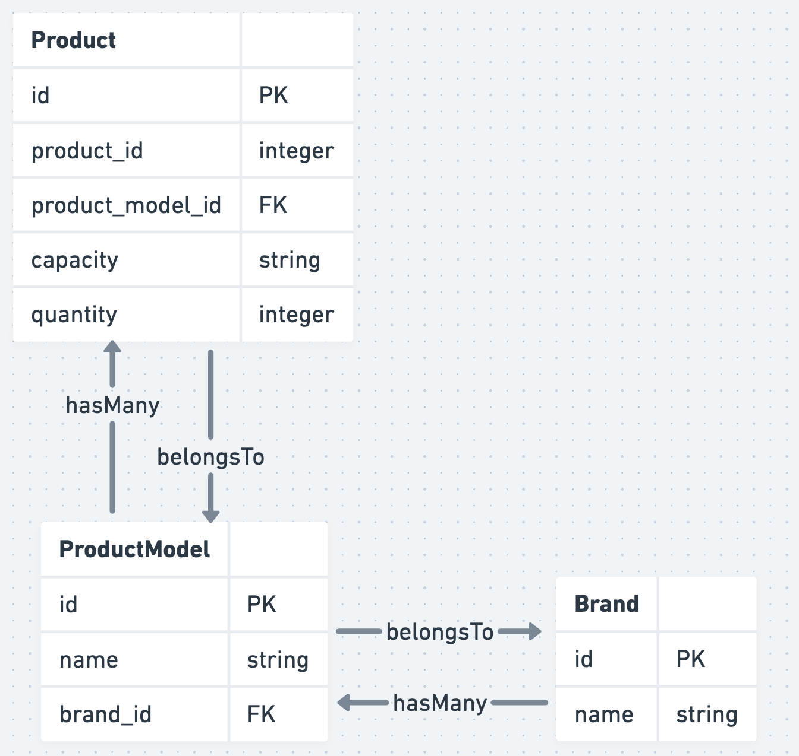
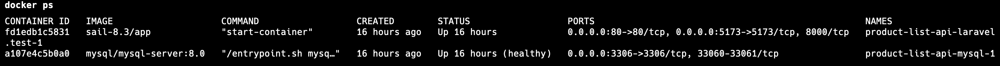

### Product List API
This repository is the backend to serve api for Product List application using Laravel 10 and MySQL database.

### Database design
Here is the database design to store the product master list.

### Installation
To install this in your local machine, we can utilize Docker container to install the defined tools and packages. Assuming Composer and Docker are ready in your machine, you can proceed with these steps:
1. Open root directory in the terminal and run `composer install`.
2. Run `cp .env.example .env` to create .env file.
3. Run `php artisan key:generate` to generate the key.
4. Run `./vendor/bin/sail up -d` to spin up the docker container. This will spin up Laravel container and MySQL database.

5. Once the container is up, you can connect into the container using the container name by running this `docker exec -it product-list-api-laravel.test-1 bash`.
6. Next, you can execute the following commands:
  - Run migration `php artisan migrate`.
  - Run seeder `php artisan db:seed`.
7. Run `php artisan queue:listen` to listen to process jobs from the default queue.

At this point, the API is now ready to serve the request from frontend. You may submit a request against this URL `http://localhost/api/product`.

Let's proceed with setting up the frontend webclient here: https://github.com/RajaAsyraf/product-list-webclient